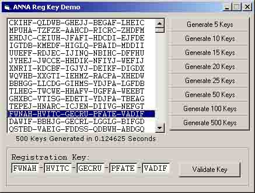



## Reg Key Demo

### Description

Generates and Validates a 25Character Registration code. Extensive integrity checking on the validation process to ensure only the original key values can be validated. Well commented and easy to follow.
 
### More Info
 

             |
---                |---
**Submitted On**   |2002-07-13 14:47:24
**By**             |[Teco](https://github.com/Planet-Source-Code/PSCIndex/blob/master/ByAuthor/teco.md)
**Level**          |Intermediate
**User Rating**    |5.0 (10 globes from 2 users)
**Compatibility**  |VB 6\.0
**Category**       |[String Manipulation](https://github.com/Planet-Source-Code/PSCIndex/blob/master/ByCategory/string-manipulation__1-5.md)
**World**          |[Visual Basic](https://github.com/Planet-Source-Code/PSCIndex/blob/master/ByWorld/visual-basic.md)
**Archive File**   |[Reg\_Key\_De1058587132002\.zip](https://github.com/Planet-Source-Code/teco-reg-key-demo__1-36871/archive/master.zip)

